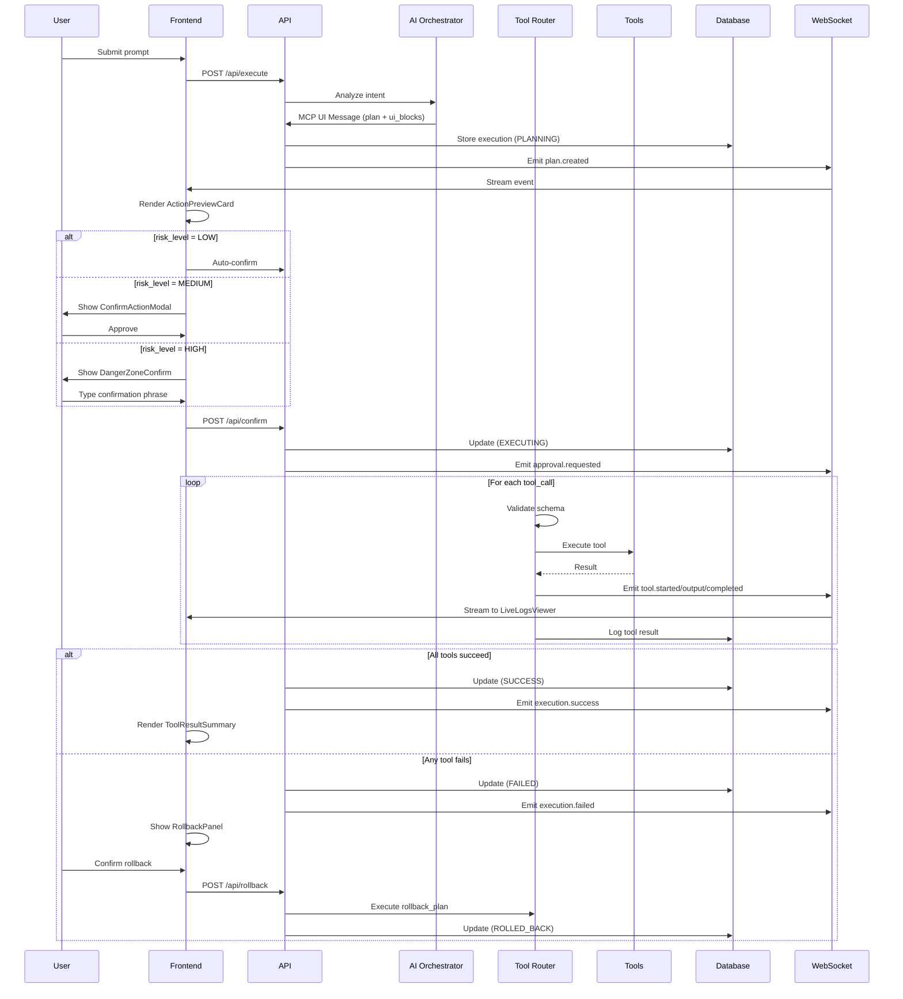
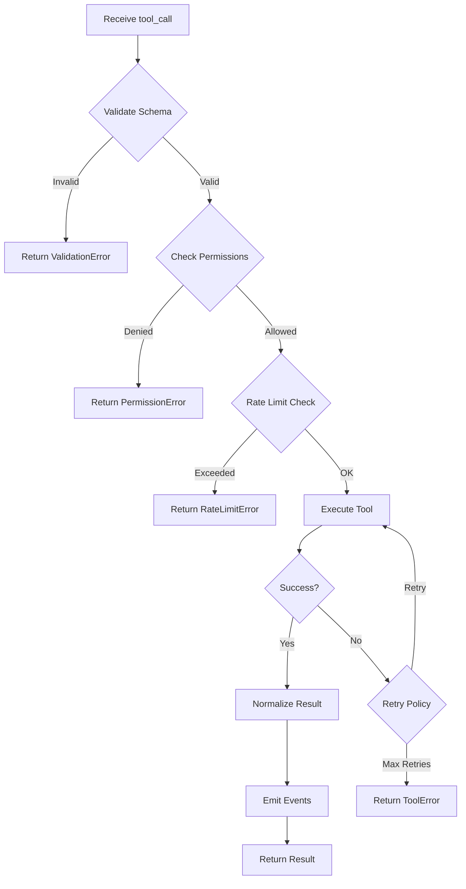

# MCP Toolchain Composer - Implementation Flow

> Detailed step-by-step execution flow for the Safe Action UI system

---

## Complete Execution Lifecycle



---

## State Machine Details

### States

| State | Description | UI Display |
|-------|-------------|------------|
| `IDLE` | No active execution | Input prompt form |
| `PLANNING` | AI generating plan | Loading spinner |
| `AWAITING_APPROVAL` | Plan ready for review | Preview + Confirm UI |
| `EXECUTING` | Tools running | Logs + Progress |
| `SUCCESS` | All tools completed | Result summary |
| `FAILED` | Tool error occurred | Error + Rollback |
| `ROLLING_BACK` | Rollback in progress | Rollback logs |
| `ROLLED_BACK` | Rollback complete | Final status |

### Transitions

```
IDLE
  └─► PLANNING (user submits prompt)
        └─► AWAITING_APPROVAL (AI returns plan)
              ├─► EXECUTING (user approves)
              │     ├─► SUCCESS (all tools pass)
              │     │     └─► IDLE (reset)
              │     └─► FAILED (tool error)
              │           ├─► ROLLING_BACK (auto/manual)
              │           │     └─► ROLLED_BACK
              │           │           └─► IDLE (reset)
              │           └─► IDLE (user dismisses)
              └─► IDLE (user cancels)
```

---

## Tool Router Flow



---

## UI Rendering Logic

```javascript
function renderUIBlocks(mcpMessage) {
  const { risk_level, ui_blocks, plan, tool_calls } = mcpMessage;

  // Always show preview
  render(<ActionPreviewCard plan={plan} tools={tool_calls} />);

  // Conditional confirmation
  if (risk_level === 'HIGH') {
    render(<DangerZoneConfirm 
      phrase={getDangerPhrase(tool_calls)} 
    />);
  } else if (risk_level === 'MEDIUM') {
    render(<ConfirmActionModal />);
  } else {
    // LOW risk - auto-execute
    executeImmediately();
  }

  // Show during execution
  if (state === 'EXECUTING') {
    render(<LiveLogsViewer />);
    render(<ProgressStepper steps={plan} />);
  }

  // Show results
  if (state === 'SUCCESS' || state === 'FAILED') {
    render(<ToolResultSummary results={results} />);
  }

  // Rollback option
  if (state === 'FAILED') {
    render(<RollbackPanel rollbackPlan={mcpMessage.rollback_plan} />);
  }
}
```

---

## Event Types

| Event | Payload | Triggered When |
|-------|---------|----------------|
| `plan.created` | `{ executionId, plan, risk_level }` | AI generates plan |
| `approval.requested` | `{ executionId }` | Awaiting user confirm |
| `approval.granted` | `{ executionId, userId }` | User approves |
| `tool.started` | `{ toolName, params }` | Tool begins |
| `tool.output` | `{ toolName, line }` | Tool logs |
| `tool.completed` | `{ toolName, result }` | Tool succeeds |
| `tool.failed` | `{ toolName, error }` | Tool errors |
| `execution.success` | `{ executionId, results }` | All complete |
| `execution.failed` | `{ executionId, error }` | Execution fails |
| `rollback.started` | `{ executionId }` | Rollback begins |
| `rollback.completed` | `{ executionId }` | Rollback done |

---

## Security Checkpoints

```
1. Authentication Check
   └─► Verify session token

2. Authorization Check
   └─► Validate user role for tool

3. Schema Validation
   └─► Zod schema validates all params

4. Permission Enforcement
   └─► Check tool-specific policies

5. Rate Limiting
   └─► Per-user, per-tool limits

6. Audit Logging
   └─► Every action persisted

7. Replay Prevention
   └─► Unique execution IDs
```

---

## Database Schema Overview

```sql
-- Executions table
CREATE TABLE executions (
  id UUID PRIMARY KEY,
  user_id UUID REFERENCES users(id),
  prompt TEXT NOT NULL,
  plan JSONB NOT NULL,
  status execution_status NOT NULL,
  risk_level risk_level NOT NULL,
  created_at TIMESTAMP DEFAULT NOW(),
  updated_at TIMESTAMP DEFAULT NOW()
);

-- Tool Calls table
CREATE TABLE tool_calls (
  id UUID PRIMARY KEY,
  execution_id UUID REFERENCES executions(id),
  tool_name VARCHAR(100) NOT NULL,
  params JSONB,
  result JSONB,
  status tool_status NOT NULL,
  started_at TIMESTAMP,
  completed_at TIMESTAMP
);

-- Audit Logs table
CREATE TABLE audit_logs (
  id UUID PRIMARY KEY,
  execution_id UUID REFERENCES executions(id),
  event_type VARCHAR(50) NOT NULL,
  payload JSONB,
  created_at TIMESTAMP DEFAULT NOW()
);
```

---

## Implementation Checklist

- [ ] **Phase 1**: Foundation
  - [ ] Monorepo setup (pnpm workspaces)
  - [ ] Shared types package
  - [ ] Build configuration

- [ ] **Phase 2**: Backend
  - [ ] API routes
  - [ ] Tool Router implementation
  - [ ] WebSocket server
  - [ ] Database models

- [ ] **Phase 3**: Frontend
  - [ ] Tambo components
  - [ ] State machine
  - [ ] WebSocket client
  - [ ] UI rendering logic

- [ ] **Phase 4**: Integration
  - [ ] End-to-end flow
  - [ ] Demo scenarios
  - [ ] Error handling

- [ ] **Phase 5**: Polish
  - [ ] Security audit
  - [ ] Testing
  - [ ] Documentation
